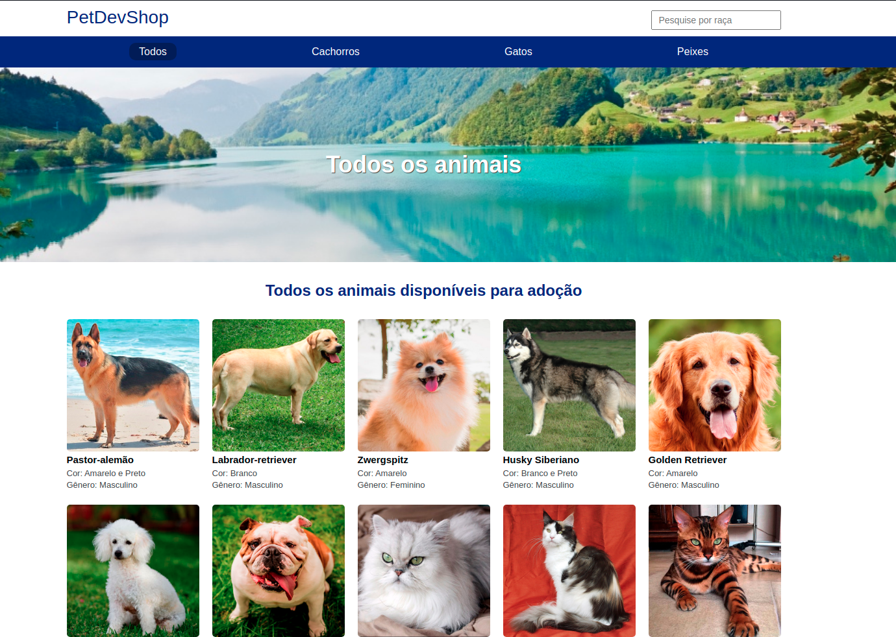
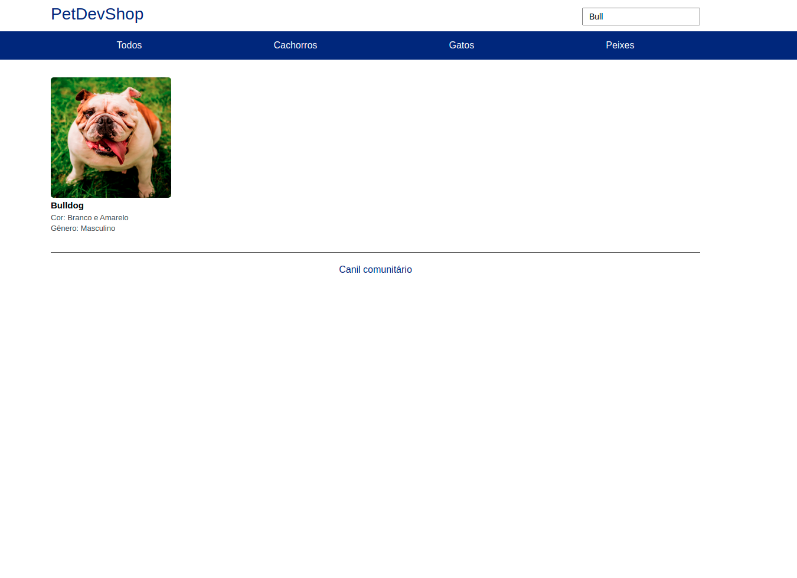
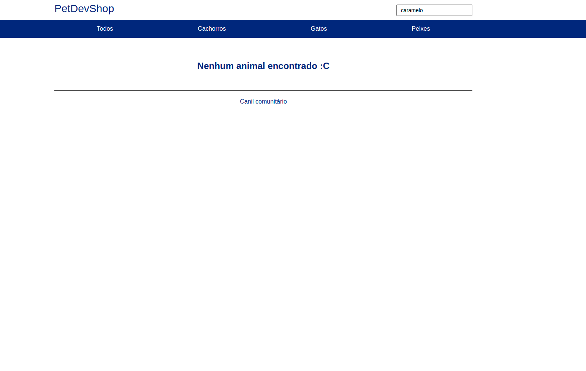
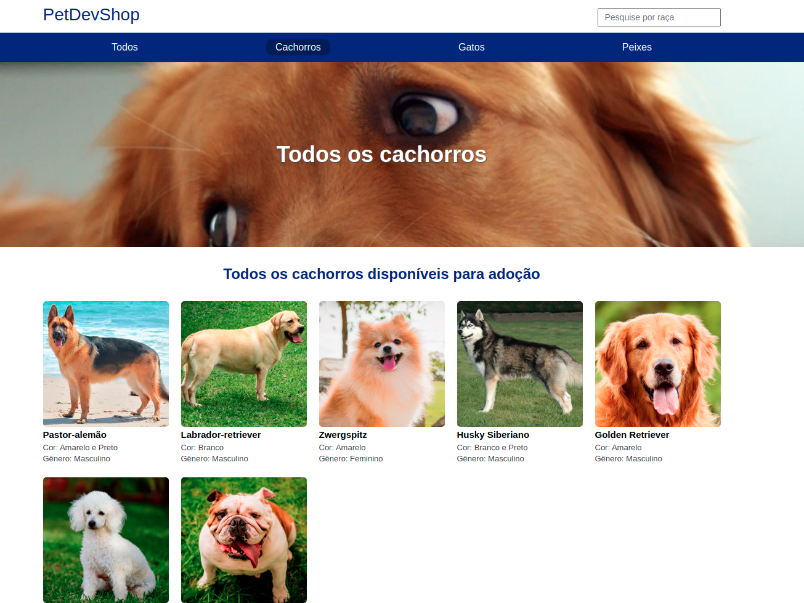

## Node-ts-canil
Projeto desenvolvido com NodeJs e Typescript

## Descrição
Consumo de um JSON local para exibir dinâmicamente. Foi colocado em prática os estudo do typescript, juntamente com o express para prática de criação, definição de rotas, bem como exibição dos seus respectivos conteúdos atráves do JSON e da renderização utlizando o Mustache. E principalmente o recurso de busca de um conteúdo por seu nome. 

### Pré-requisitos globais:
`npm install -g nodemon typescript ts-node`

## Tecnologias
<ul>
<li>NodeJS</li>
<li>Typescript</li>
<li>Express e express middlewares</li>
<li>Mustache</li>
</ul>

## Configuração de ambiente e recursos necessários para inicializar o projeto
1. Clonar o repositório.
1. Executar o comando ` npm i ` para insatalar as dependências necessárias.
1. Fazer uma cópia do arquivo `.env.example` e chamar de `.env`
1. Atualizar variáveis de ambiente no arquivo `.env`
1. Executar o comando `npm start` para inicializar o servidor
1. Necessário possuir o `typescript` instalado e configurado para executar o projeto.

### Imagens do projeto

   

### Busca

   

   

   

